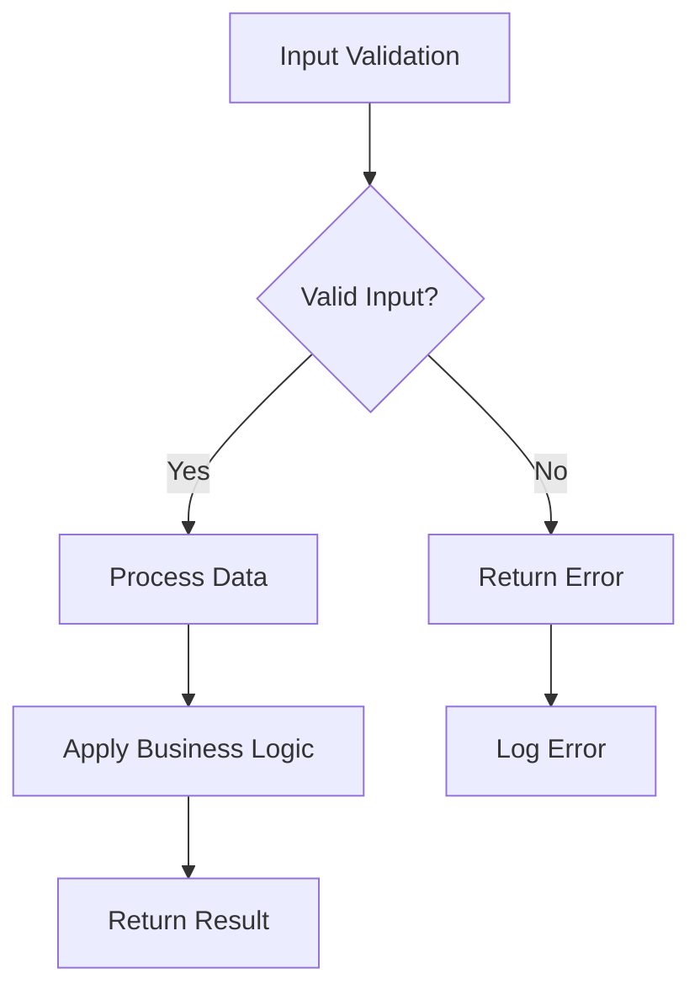

# Explain Code Workflow

## Overview
Provides comprehensive, AI-powered explanations of code segments, functions, classes, or entire files. Combines natural language explanations with visual diagrams to help developers understand complex code quickly and thoroughly.

## Command Targets

**Target types:**
- `[function-name]` - Specific function to explain
- `[class-name]` - Entire class explanation
- `[file-path]` - Explain entire file
- `[line-range]` - Explain specific lines (e.g., "125-150")
- `current-selection` - Explain currently selected code in IDE

**Automatically includes:**
- Visual diagrams (flowcharts, sequence diagrams, class diagrams)
- Intermediate complexity level (technical but accessible)
- Full context (includes dependencies and related components)
- Saves explanations to `.code-captain/explanations/` for future reference

## Examples

```bash
# Explain a specific function
/explain-code calculateUserDiscount

# Explain a class
/explain-code PaymentProcessor

# Explain entire file
/explain-code src/auth/AuthService.js

# Explain specific line range
/explain-code "src/utils/helpers.js:45-78"

# Explain currently selected code
/explain-code current-selection
```

## Workflow Process

### Step 1: Target Identification & Location

**Locate the target code:**

- Use `find_by_name` to search for files matching the target
- Use `view_code_item` to locate specific functions or classes
- Use `grep_search` to find function/class definitions by name
- Use `view_file` to read file contents for line ranges or full files

**Target validation:**
- Confirm target exists and is accessible
- If ambiguous, present multiple options for user selection
- If not found, provide suggestions for similar names

### Step 2: Context Gathering & Analysis

**Gather comprehensive context:**

- Use `codebase_search` to understand architectural context
- Use `view_file` to read related files and dependencies
- Use `grep_search` to find all usages of the target code
- Use `view_code_item` to analyze related classes/functions

**Analyze code characteristics:**
- Parse syntax and identify patterns
- Measure complexity and performance characteristics
- Understand dependencies and integration points
- Identify design patterns and architectural decisions

### Step 3: Explanation Generation

**Create structured explanation:**

**📋 Code Overview**
- Purpose: What this code does
- Parameters: Input expectations and validation
- Return Value: What it outputs and formats
- Key Logic: Step-by-step breakdown of main functionality

**🔄 Execution Flow**
- Control flow through the code
- Decision points and branching logic
- Error handling paths and edge cases
- Performance characteristics and bottlenecks

**🏗️ Architecture Context**
- Where this fits in the overall system
- Dependencies and related components
- Design patterns and architectural decisions
- Integration points with other modules

**⚡ Technical Details**
- Time and space complexity analysis
- Memory usage patterns
- Potential issues and gotchas
- Optimization opportunities

### Step 4: Visual Diagram Creation

**Generate appropriate diagrams using Mermaid syntax:**

**Flowcharts:**
- Control flow through functions
- Decision trees for complex logic
- Error handling paths

**Sequence Diagrams:**
- Function call sequences
- API interaction flows
- Database transaction flows

**Class Diagrams:**
- Object relationships
- Inheritance hierarchies
- Dependency structures

**Example Mermaid flowchart:**


### Step 5: Documentation & Auto-Save

**Save explanation with date prefix:**

Use `write_to_file` to create explanation file in `.code-captain/explanations/[DATE]-[target-name].md`

**File format:**
```markdown
# Code Explanation: [Target Name]

_Generated on [DATE]_

## Overview
[Natural language summary of purpose and functionality]

## Execution Flow
```mermaid
[Generated diagram showing control flow]
```

## Detailed Breakdown
[Step-by-step explanation of key logic and decision points]

## Architecture Context
[How this code fits within the broader system architecture]

## Usage Examples
[Practical examples of how to use this code]

## Related Components
[Links to other explanations and dependencies]

## Technical Analysis
[Performance characteristics, complexity, and optimization notes]

---
_Generated by Code Captain on [timestamp]_
```

### Step 6: Date Determination

**Primary method - File system timestamp:**
1. Create directory if not exists: `.code-captain/explanations/`
2. Create temporary file: `.code-captain/explanations/.date-check`
3. Read file creation timestamp from filesystem
4. Extract date in YYYY-MM-DD format
5. Delete temporary file
6. Store date for file naming

**Fallback method - User confirmation:**
If file system method fails:
1. Ask user: "What is today's date? (YYYY-MM-DD format)"
2. Validate format matches `^\d{4}-\d{2}-\d{2}$`
3. Store date for file naming

### Step 7: Present Results

**Display structured explanation in chat:**
- Overview with purpose and key functionality
- Visual diagram showing execution flow
- Detailed breakdown of logic and decision points
- Architecture context and system integration
- Technical analysis with performance notes
- Usage examples and related components

**Confirm auto-save:**
- Notify user that explanation saved to `.code-captain/explanations/[DATE]-[target-name].md`
- Provide file path for future reference
- Mention integration with other Code Captain commands

## Output Characteristics

**Technical level:** Intermediate complexity balancing accessibility with depth
**Context:** Always includes related functions, dependencies, and architectural context
**Visual elements:** Every explanation includes appropriate diagrams
**Comprehensive:** Shows how code fits in the entire system
**Saved format:** Markdown with Mermaid diagrams for future reference

## Integration with Code Captain Ecosystem

**Cross-command integration:**
- Saved explanations accessible by `/research` workflow for context
- Referenced by `/create-spec` workflow for understanding existing patterns
- Used by `/execute-task` workflow for implementation guidance
- Integrated with other workflows for comprehensive codebase understanding

**File organization:**
```
.code-captain/
└── explanations/
    ├── 2024-01-15-AuthenticationFlow.md
    ├── 2024-01-16-PaymentProcessor.md
    ├── 2024-01-16-UserService.md
    └── 2024-01-17-SearchAlgorithm.md
```

Files named: `[DATE]-[target-name].md` (YYYY-MM-DD format)

## Error Handling

**Common issues and responses:**
- **Code not found**: "Could not locate [target]. Please check the path/name." Use `find_by_name` to suggest alternatives
- **Too complex**: "This code is very complex. Consider breaking into smaller explanations."
- **Limited context**: "Some context may be missing. Ensure related files are accessible."

**Fallback behaviors:**
- If diagrams fail to generate, provide text-based flow description
- If target is ambiguous, offer multiple options using `grep_search` results
- If code is too large, suggest breaking into smaller segments

**Resolution strategies:**
1. Use `codebase_search` to find alternative approaches
2. Break complex code into logical segments
3. Provide partial explanations with clear boundaries
4. Suggest related files or functions for additional context

## Diagram Types

**Flowcharts:** Control flow, decision trees, error handling paths
**Sequence diagrams:** Function calls, API interactions, database transactions
**Class diagrams:** Object relationships, inheritance, dependencies
**Architecture diagrams:** Component interactions, data flow, service communication

## Management Features

**Explanation discovery:**
- Use `find_by_name` to list all saved explanations
- Use `grep_search` to search explanation content
- Use `view_file` to read previous explanations for context

**Update detection:**
- Compare file modification times with explanation dates
- Suggest refreshing explanations for changed code
- Maintain explanation history and versioning

## Quality Standards

**Clarity:** Explanations understandable to developers at intermediate level
**Completeness:** Cover purpose, logic, context, and technical details
**Accuracy:** Reflect actual code behavior and architectural patterns
**Visual:** Include appropriate diagrams for better understanding
**Consistency:** Use standard format and terminology across explanations

## Windsurf Tools Used

- `find_by_name`: Locate target files, functions, and classes
- `view_file`: Read file contents and related code
- `view_code_item`: Examine specific code elements (classes, functions)
- `codebase_search`: Understand architectural context and dependencies
- `grep_search`: Find function definitions, usages, and patterns
- `write_to_file`: Save explanations to dated files
- `list_dir`: Explore directory structure for context

## Windsurf Features Used

- **Memories**: After explaining complex architectural patterns, ask Cascade to "create a memory of this architectural pattern and its usage"

---

*🧠 Understanding code through comprehensive explanation and visual insight.*